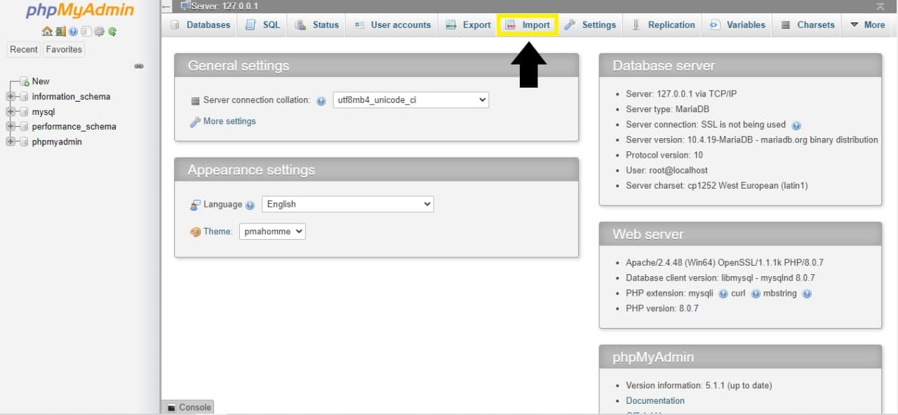
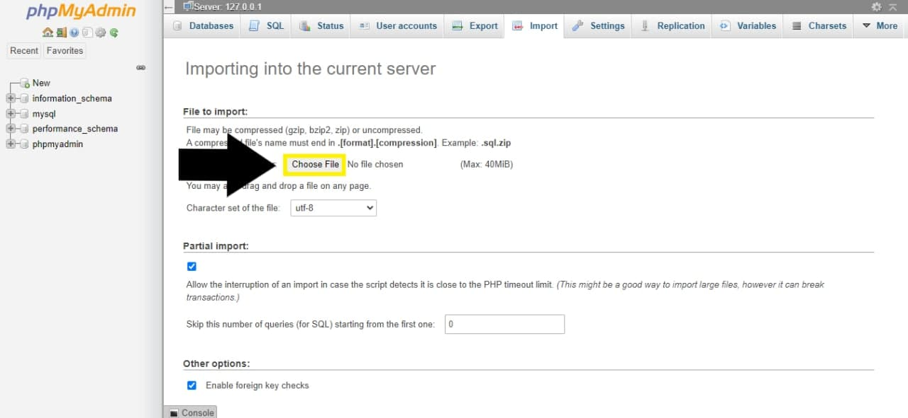

<!-- ALL-CONTRIBUTORS-BADGE:START - Do not remove or modify this section -->
[](#contributors-)
<!-- ALL-CONTRIBUTORS-BADGE:END -->

<hr>

**NOTE**: This library management system supposingly is made for our school, but since this the committee need to test and run this web app, the committee need to follow the steps below to simulate the same experience we have in our developers' environment. 

# Installation

**Download this repository by ```git clone https://github.com/devpandaz/pathfinder.git``` or click "Download zip". Move the lms folder inside this pathfinder repository to your xampp htdocs folder and rename the lms folder to ```pathfinder```.**

Download [XAMPP](https://www.apachefriends.org/index.html). This will be your server.
Go to [phpmyadmin at localhost](http://localhost/phpmyadmin/). Select the import tab.

Choose [pathfinder.sql](https://github.com/devpandaz/pathfinder/blob/main/lms/pathfinder.sql) from the pathfinder folder in your htdocs folder. (You will have this pathfinder folder in your htdocs folder if you followed the steps above. )

Click "Go". 

1. Create a new Facebook page and setup the Facebook Chat Plugin. This is for the live chat features of this web app that the users can communicate with/seek live help from the authorities of the Facebook page. Once done setting up the chat plugin, change the code inside the line ```chatbox.setAttribute("page_id", "[code_here]");``` at [header.php](https://github.com/devpandaz/pathfinder/blob/main/lms/header.php) (line 34) to your Facebook Chat Plugin code. 
2. Create a [Disqus](https://disqus.com/) account. Set up a new Disqus site. Once done, change s.src at [book.php](https://github.com/devpandaz/pathfinder/blob/main/lms/book.php) (line 134: ```s.src = 'https://pathfinderlibms.disqus.com/embed.js';```) to the embed.js file of your Disqus site (you can get the embed source during setup/installation process of your Disqus site). 
3. Create a new Google Account specially for testing. Turn on "Allow less secure apps". Change the email at [includes/feedback.inc.php](https://github.com/devpandaz/pathfinder/blob/main/lms/includes/feedback.inc.php) (line 54, 60, 61) and [includes/reset-request.inc.php](https://github.com/devpandaz/pathfinder/blob/main/lms/includes/reset-request.inc.php) (line 65, 71) to the new Google account email created. 
4. Add your Gmail password to [.env file](https://github.com/devpandaz/pathfinder/blob/main/lms/.env) (line 1: ```EMAIL_PASSWORD = [email password here]```). 
5. Sign up for ngrok. Install and setup ngrok to your local computer. 
6. Once all the accounts are set up: 
    1. Start localhost. 
    2. run ```ngrok http 443``` at Command Prompt. 
    3. If installing for the first time, add the generated domain to [.env file](https://github.com/devpandaz/pathfinder/blob/main/lms/.env) (line 2: ```DOMAIN = [ngrok domain here]```) also. 
    4. Copy the generated domain and paste it to your browser. Add ```pathfinder``` behind the ngrok domain. Thus it would become ```https://[code].ngrok.io/pathfinder```. Press enter and the home page of this web app will come up. 
    
    Since we don't have a paid server to host our web app, we ask you to use ngrok locally. Thus, the domain link would change everytime you run a new ```ngrok http``` command. Therefore, you have to actually change the domain to the generated ngrok domain at your Disqus site and your FB Chat Plugin "Website Domain" EVERY SINGLE TIME. 
    ALSO, REMEMBER TO CHANGE THE DOMAIN EVERY TIME AT [.env file](https://github.com/devpandaz/pathfinder/blob/main/lms/.env) (line 2: ```DOMAIN = [ngrok domain here]```). 

*For admin access to this library system, log in with Username: admin (or Email: admin@admin.com) and Password: 1234abcd. You may change this admin password later anytime at profile page. 

**Note**: Our product name is "Pathfinder", thus you will see "Pathfinder" everywhere. In our devs' team environment, we setup and used our own Pathfinder accounts for the FB Chat Plugin, Disqus and also Gmail. However, since there's no way we can share access of these accounts, we asked you to setup your own ones. 

# Report and Presentation Video
Click [here](https://devpandaz.github.io/pathfinder/report-and-video.html) for the report and presentation video of this project. 

## Contributors ✨

Thanks goes to these wonderful people ([emoji key](https://allcontributors.org/docs/en/emoji-key)):

<!-- ALL-CONTRIBUTORS-LIST:START - Do not remove or modify this section -->
<!-- prettier-ignore-start -->
<!-- markdownlint-disable -->
<table>
  <tr>
    <td align="center"><a href="https://github.com/TheLoneGuy"><br /><sub><b>Tan Ting Hong</b></sub></a><br /><a href="https://github.com/devpandaz/pathfinder/commits?author=TheLoneGuy" title="Code">💻</a></td>
  </tr>
</table>

<!-- markdownlint-restore -->
<!-- prettier-ignore-end -->

<!-- ALL-CONTRIBUTORS-LIST:END -->

This project follows the [all-contributors](https://github.com/all-contributors/all-contributors) specification. Contributions of any kind welcome!
